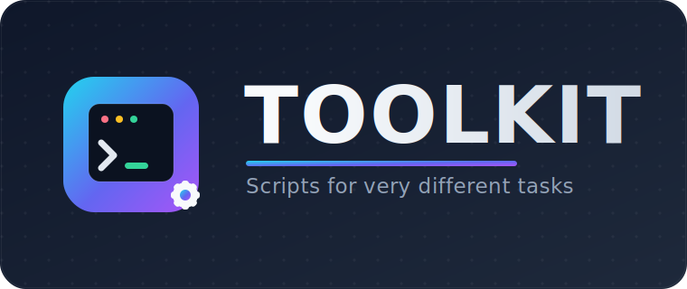

<p align="center">
  
</p>

<p align="center">
  <b>A growing collection of scripts for very different tasks.</b><br>
  <sub>System administration · automation · one-off helpers — each script documented and ready to run.</sub>
</p>

<p align="center">
  <a href="README.md">🇬🇧 English</a> &nbsp;•&nbsp; <a href="README.ru.md">🇷🇺 Русский</a>
</p>

<p align="center">
  
  
  
</p>

---

## 📖 About

`toolkit` is a single home for standalone scripts that each solve an unrelated problem — from
server maintenance to quick automation helpers. There is no shared framework: every script is
self-contained, documented below, and safe to copy out and run on its own.

This README is the project's front page and grows together with the repository: **every new
script gets its own block** with a short description and the commands to run it.

## 🧰 Scripts

| Script | Category | What it does |
|---|---|---|
| [`proxmox-wipe.sh`](#proxmox-wipesh) | Proxmox | Destroys all guests and zeroes every non-system disk, with a live progress bar + ETA. |

> 📌 This table grows as new scripts are added.

---

### `proxmox-wipe.sh`

> 🧨 Destroy every VM/CT and **zero all non-system disks** on a Proxmox host — safely, with a live progress bar and ETA.

**Location:** [`proxmox/proxmox-wipe.sh`](proxmox/proxmox-wipe.sh)

System disks backing `/`, `/boot` and `/boot/efi` are auto-detected by two independent methods
and protected; if detection finds nothing valid, the script aborts instead of guessing. Data
disks are erased with `dd` (live progress bar + ETA) or, with `--discard`, a fast hardware zero.

#### ▶️ Run

```bash
chmod +x proxmox/proxmox-wipe.sh
sudo ./proxmox/proxmox-wipe.sh --dry-run
```

#### Commands

| Command | Purpose |
|---|---|
| `./proxmox-wipe.sh --dry-run` | **Preview only.** Prints the `[KEEP]` / `[WIPE]` disk lists and the guests that would be removed — nothing is changed. Always run this first. |
| `./proxmox-wipe.sh --only sdb,sdc,sdd,sde --dry-run` | Preview a wipe restricted to the named disks (recommended, safest). |
| `./proxmox-wipe.sh --only sdb,sdc,sdd,sde` | Wipe **only** the explicitly named disks. |
| `./proxmox-wipe.sh` | Wipe **all** non-system disks on the host. |

#### Options

| Flag | Description |
|---|---|
| `-n`, `--dry-run` | Preview every action without changing anything. |
| `--only sdX,sdY` | Restrict the wipe to an explicit comma-separated disk list; a system disk in the list is rejected. |
| `-y`, `--yes` | Skip the interactive confirmation prompt. |
| `--discard` | Use `blkdiscard -z` for a fast hardware zero (no progress bar); falls back to `dd` if unsupported. |
| `-h`, `--help` | Print the script's built-in help. |

> ⚠️ **Destructive and irreversible.** Must run as `root`. It permanently destroys every VM/CT and
> zeroes the listed disks — there is **no undo**. Without `--yes` you must type `ERASE-ALL-DATA`
> to proceed. A full log is written to `/var/log/proxmox-wipe-*.log`.

---

## 🗂 Repository structure

```text
toolkit/
├── assets/
│   └── logo.svg
├── proxmox/
│   └── proxmox-wipe.sh
├── README.md        # English (this file)
└── README.ru.md     # Русский
```


---

<p align="center"><sub>⚠️ Use these scripts at your own risk. Review the source before running anything that touches disks or data.</sub></p>
