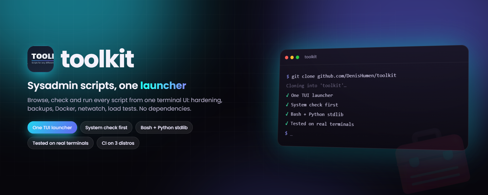

<div align="center">



# toolkit

**A growing collection of sysadmin scripts for very different tasks, with one terminal launcher that checks your machine before anything runs.**

System administration · automation · one-off helpers. Every script is documented and ready to run.

[](https://github.com/DenisHumen/toolkit/actions/workflows/ci.yml)
[](#-script-reference)
[](toolkit.py)
[](#-quick-start)
[](https://github.com/DenisHumen/toolkit/commits/main)

**English** · [Русский](README.ru.md)

[Features](#-features) · [Scripts](#-scripts) · [Quick start](#-quick-start) · [Launcher](#-usage) · [Script reference](#-script-reference)

</div>

---

`toolkit` is a single home for standalone scripts that each solve an unrelated problem, from server maintenance to quick automation helpers. There is no shared framework: every script is self-contained, documented below, and safe to copy out and run on its own. On top sits `./toolkit.sh`, a terminal UI that finds every script, checks whether **this** machine can run it, and starts it after one confirmation.

This README is the project's front page and grows with the repository: **every new script gets its own block** with a short description and the commands to run it.

## ✨ Features

| | |
|---|---|
| 🎛 **One entry point** | `./toolkit.sh` lists every script in the repo, grouped by category, with a live status mark and a short reason tag. |
| 🩺 **System check first** | Distro, root/sudo, required commands, busy ports, internet access and "already installed?" are checked before a script runs, and every blocker comes with a fix. |
| 🧾 **Nothing hidden** | Before a run you see what the script does, the exact command, what it will change (files, ports, packages, root) and the check results line by line. |
| 🧪 **Safe previews** | `p` runs a script's own dry-run mode; destructive scripts require a typed confirmation word. |
| ⬆️ **Update notices** | A background check against the public GitHub API, cached for hours. Updates are fast-forward only and never happen without a keypress. |
| 🧩 **Self-describing scripts** | Drop a `.sh` or `.py` file into the repo and it shows up; `# toolkit-*:` header lines control how it is presented. |
| 📦 **Zero dependencies** | Bash plus the Python 3 standard library. Every script still works without the launcher. |
| ✅ **Tested on real terminals** | A pty-driven suite, `shellcheck`, container round trips, and CI on Debian 12, Ubuntu 24.04 and Fedora 40. |

## 🧰 Scripts

| Script | Category | Root | What it does |
|---|---|---|---|
| [`proxmox-wipe.sh`](#proxmox-wipesh) | Proxmox | required | Destroys all guests and zeroes every non-system disk, with a live progress bar + ETA. |
| [`install-docker.sh`](#install-dockersh) | Containers | required | Auto-detects the distro and installs Docker Engine + Compose v2 from Docker's official repos. |
| [`install-pingvin-share.sh`](#install-pingvin-sharesh) | Containers | required | Deploys Pingvin Share via Docker behind a Caddy reverse proxy with automatic HTTPS, and opens the firewall. |
| [`harden.sh`](#hardensh) | Security | optional | Audits a server's security posture, scores it, and applies the safe fixes, with anti-lockout guarantees and a rollback. |
| [`backup.sh`](#backupsh) | Maintenance | optional | Archives chosen paths and Docker volumes, verifies every archive, prunes old ones, and restores them into a staging directory unless you say otherwise. |
| [`loadtest`](#loadtest) | Diagnostics | no | Authorized load / WAF / rate-limit tester: measures how well **your own** site blocks traffic, optionally through a rotating proxy pool. |
| [`netwatch`](#netwatch) | Diagnostics | optional | Continuously measures a connection (ICMP, DNS, HTTP, throughput, multi-WAN failover) into SQLite, then writes a Markdown report with charts and a verdict naming the layer at fault. |

> 📌 This table grows as new scripts are added.

## 🚀 Quick start

**Requirements:** Linux (Debian/Ubuntu, Fedora/RHEL and others; see each script), `bash`, and **Python 3.8+** for the launcher. If Python is missing, `toolkit.sh` offers to install it with the system package manager (apt, dnf, yum, pacman, zypper or apk).

```bash
git clone https://github.com/DenisHumen/toolkit.git
cd toolkit
chmod +x toolkit.sh
./toolkit.sh
```

Or skip the launcher and run any script directly. Most support a preview first:

```bash
sudo ./linux/install-docker.sh --dry-run
./linux/harden.sh                      # read-only audit
./linux/netwatch/netwatch.sh --quick   # 90-second connection diagnostic
```

## ⚙️ Configuration

The launcher has no config file. Two environment variables change its behaviour:

| Variable | Default | Description |
|---|---|---|
| `TOOLKIT_NO_UPDATE_CHECK` | unset | Set to `1` to turn off the background update check (same as `--no-update-check`). |
| `TOOLKIT_CACHE_DIR` | `$XDG_CACHE_HOME/toolkit` or `~/.cache/toolkit` | Where the cached update-check result is kept. |

Each script takes its own flags; see the [Script reference](#-script-reference).

## 🧭 Usage

### The launcher: `./toolkit.sh`

> Everything below can be browsed, checked and started from a single TUI. It finds every script in the repo, works out what each one needs, tells you whether **this** machine can run it, and starts the one you pick after a single confirmation.

<p align="center">
  <sub>↑↓ pick a script · ⏎ see the summary and the system check · ⏎ again to run · <code>p</code> dry run · <code>o</code> options · <code>d</code> docs · <code>/</code> filter · <code>q</code> quit</sub>
</p>

Each entry is marked with what the launcher found out about your machine:

| | Meaning |
|---|---|
| ✔ | ready: every requirement is met |
| ▲ | runnable, but read the notes (a missing argument, a port already in use) |
| ✖ | blocked: wrong distro, no root, a required command is missing |
| ● | already installed / already present here |

Every entry also carries a short tag saying **why** it is not simply ready (`needs root`, `no curl`, `needs --domain`, `not debian`, `installed`), so the list answers the question without being opened.

Selecting a script shows a full summary before anything runs: **what it does**, the **exact command** that will be executed, what it will **change** (files, ports, packages, whether it needs root) and the **system check** line by line. One more `⏎` starts it; the script then owns the terminal, so its own prompts and TUIs work normally, and you land back in the launcher when it finishes. Scripts that only need to *run* (rather than install anything) start the same way: `netwatch`, `loadtest` and `harden` open their own interfaces from here.

<details>
<summary><b>All keys</b></summary>

| Key | Action |
|---|---|
| `↑` `↓` · `PgUp` `PgDn` · `Home` `End` | Move between scripts |
| `⏎` / `→` | Open the summary, then `⏎` again to start |
| `p` | Preview: run the script's own dry-run mode, changing nothing |
| `o` | Options: fill in the arguments a script asks for |
| `d` | Docs: the script's README or its header |
| `f` | On a blocked script's summary: try anyway |
| `/` | Filter the list by name (`Esc` clears it) |
| `s` | What the launcher detected about this machine |
| `u` | Open the update screen |
| `r` | Re-scan the repository and re-run the checks |
| `?` / `h` | Help |
| `q` | Quit |

</details>

#### Started without root

The header states what this session can actually do: `root`, `sudo` (no password needed), `sudo 🔑` (it will ask for one), or `no root ✖`. When the session cannot become root at all, every script that requires it is marked red and **will not be run**:

```text
╭─ scripts ───────────────────────────────────╮╭─ Docker Engine + Compose v2 ──────────────────╮
│ CONTAINERS                                  ││  ✔ Ubuntu 24.04.4 LTS is a supported system   │
│  ▸ ✖ Docker Engine + Compose…  needs root   ││  ✖ this script must run as root, and this     │
│    ✖ Pingvin Share (file sha…  needs root   ││    session cannot become root: this account   │
│ SECURITY                                    ││    may not use sudo                           │
│    ▲ Server hardening (audit + …  limited   ││                                               │
│    ✔ loadtest — WAF / rate-limit tester     ││  ✖ will not run on this machine               │
╰─────────────────────────────────────────────╯╰───────────────────────────────────────────────╯
```

Opening one does not hide the problem behind a failed run. It explains the problem and says what to do:

```text
 ✖ This will not run on this machine.

   Why  this script must run as root, and this session cannot become root:
        this account may not use sudo

   Fix  Log in as root (or as a user allowed to use sudo) and start it again:
        su -
        ./toolkit.sh
        Running the script directly will fail for the same reason.

   Esc back · d docs · o options · f try anyway
```

The other blockers get the same treatment: a missing command comes with the `apt install` line for this distro, the wrong distribution says which ones the script targets, and being offline points at the connection. Scripts that merely *prefer* root (like the security audit) run anyway and are tagged `limited`, because they degrade rather than fail. `f` still forces a run, for when you know better than the check.

#### Command line

```bash
./toolkit.sh --list           # what was discovered, and its status on this machine
./toolkit.sh --check          # every system check, in full
./toolkit.sh --run harden     # run one script directly
./toolkit.sh --run netwatch --duration 30m --yes
```

<details>
<summary><b>All launcher flags</b></summary>

| Flag | Description |
|---|---|
| *(none)* | Interactive browser. Without a terminal, prints the list instead. |
| `--list`, `-l` | Print the discovered scripts and their status, then exit. |
| `--check` | Run every system check and print it in full. |
| `--run <name> [args…]` | Run one script (matched by id, file name or path); extra arguments are passed on. |
| `--run <name> --preview` | Run the script's preview (dry-run) arguments instead. |
| `--run <name> --force` | Run even if the system check blocks it. |
| `--no-detect` | Skip the "is it already installed?" probes. |
| `--check-update` | Show what is new on GitHub without changing anything. |
| `--update` | Fast-forward this checkout (`git pull --ff-only`). |
| `--no-update-check` | Disable the background update check. |
| `--version` · `--help` | Print the version · print help. |

</details>

### Staying up to date

When the launcher starts it asks GitHub, **in the background**, whether this checkout is behind. The check never blocks anything, needs no credentials (public API over HTTPS), and its answer is cached for a few hours; while the cache is fresh, no network call happens at all. If something is new, a line appears in the header (illustrative output):

```text
╭─ toolkit 1.0 ─────────────────────────────────────────────────────────────────╮
│ Ubuntu 24.04.4 LTS · kernel 6.6.114 · x86_64 · apt · systemd ✔ · sudo · net ✔  │
│ 8 scripts discovered   2 installers  5 tools  1 destructive                    │
│ ⬆ Update available · 3 new commits on DenisHumen/toolkit · press u             │
╰───────────────────────────────────────────────────────────────────────────────╯
```

Pressing `u` shows what actually changed (every commit with its message and age, the files that will change, and the exact command that will run), then leaves the decision to you:

```text
 What's new
   a1b2c3d  feat(certcheck): warn before a TLS certificate expires    4 hours ago
   e4f5a6b  fix(backup): keep sparse files sparse                       1 day ago
   0c9d8e7  docs: explain the anti-lockout rules                       2 days ago

 How it updates
   git pull --ff-only origin main
   fast-forward only — it can never rewrite or discard a local commit

 ✔ Ready to update
   ⏎ update now    s skip this version    r re-check    Esc back
```

`⏎` updates and reloads the launcher, so the version you continue in is the one that just arrived. `s` silences that particular version until a newer one appears. Nothing happens without a keypress.

It refuses rather than guesses: a modified working tree, a checkout with commits GitHub has never seen, or a copy that is not a git clone all produce an explanation instead of an update. From the command line:

```bash
./toolkit.sh --check-update      # what is new, without changing anything
./toolkit.sh --update            # fast-forward this checkout
./toolkit.sh --no-update-check   # or TOOLKIT_NO_UPDATE_CHECK=1, to turn it off
```

### Adding your own script

Drop a `.sh` or `.py` file anywhere in the repo and **it appears in the launcher on the next run**, described from its own header comment (a script without metadata falls back to its shebang, file name and first comment block). To control how it is presented, add `# toolkit-*:` lines.

<details>
<summary><b>Metadata reference</b></summary>

```bash
# toolkit-name: Human readable name
# toolkit-kind: installer | tool | destructive
# toolkit-category: Containers
# toolkit-summary: One line describing what it does.
# toolkit-os: debian, fedora          # which systems it supports (default: any)
# toolkit-root: yes | no | optional
# toolkit-needs: curl, systemctl      # commands that MUST exist, or it is blocked
# toolkit-optional: gpg               # nice to have; only mentioned
# toolkit-detect: command -v docker   # "is it already installed here?"
# toolkit-preview: --dry-run          # arguments for a safe preview run
# toolkit-run: --yes                  # default arguments
# toolkit-arg: --domain | Domain to serve on | required
# toolkit-ports: 80,443               # ports it opens (checked for conflicts)
# toolkit-writes: /opt/thing          # paths it creates
# toolkit-danger: what it destroys    # shown in red for destructive scripts
# toolkit-confirm: ERASE-ALL-DATA     # word the user must type first
# toolkit-docs: linux/thing/README.md
# toolkit-order: 50                   # position in the list (lower comes first)
# toolkit-hidden: yes                 # keep a helper out of the list
```

</details>

The launcher needs nothing but Python 3 (present on every mainstream distro), and every script here still runs standalone: it is a convenience layer, not a dependency.

## 📚 Script reference

### `proxmox-wipe.sh`

> 🧨 Destroy every VM/CT and **zero all non-system disks** on a Proxmox host, safely, with a live progress bar and ETA.

**Location:** [`proxmox/proxmox-wipe.sh`](proxmox/proxmox-wipe.sh)

System disks backing `/`, `/boot` and `/boot/efi` are auto-detected by two independent methods and protected; if detection finds nothing valid, the script aborts instead of guessing. Data disks are erased with `dd` (live progress bar + ETA) or, with `--discard`, a fast hardware zero.

```bash
chmod +x proxmox/proxmox-wipe.sh
sudo ./proxmox/proxmox-wipe.sh --dry-run
```

> [!WARNING]
> **Destructive and irreversible.** Must run as `root`. It permanently destroys every VM/CT and zeroes the listed disks, and there is **no undo**. Without `--yes` you must type `ERASE-ALL-DATA` to proceed. A full log is written to `/var/log/proxmox-wipe-*.log`.

<details>
<summary><b>Commands and options</b></summary>

| Command | Purpose |
|---|---|
| `./proxmox-wipe.sh --dry-run` | **Preview only.** Prints the `[KEEP]` / `[WIPE]` disk lists and the guests that would be removed; nothing is changed. Always run this first. |
| `./proxmox-wipe.sh --only sdb,sdc,sdd,sde --dry-run` | Preview a wipe restricted to the named disks (recommended, safest). |
| `./proxmox-wipe.sh --only sdb,sdc,sdd,sde` | Wipe **only** the explicitly named disks. |
| `./proxmox-wipe.sh` | Wipe **all** non-system disks on the host. |

| Flag | Description |
|---|---|
| `-n`, `--dry-run` | Preview every action without changing anything. |
| `--only sdX,sdY` | Restrict the wipe to an explicit comma-separated disk list; a system disk in the list is rejected. |
| `-y`, `--yes` | Skip the interactive confirmation prompt. |
| `--discard` | Use `blkdiscard -z` for a fast hardware zero (no progress bar); falls back to `dd` if unsupported. |
| `-h`, `--help` | Print the script's built-in help. |

</details>

---

### `install-docker.sh`

> 🐳 One installer for **Docker Engine + Docker Compose v2** that detects the distro and runs the matching official path: apt on Ubuntu/Debian, dnf on Fedora/RHEL/CentOS.

**Location:** [`linux/install-docker.sh`](linux/install-docker.sh)

Reads `/etc/os-release` to pick the right package manager and Docker repository, then installs the same official package set everywhere: `docker-ce`, `docker-ce-cli`, `containerd.io`, `docker-buildx-plugin` and `docker-compose-plugin` (Compose v2, used as `docker compose`). It also enables the service and adds your user to the `docker` group. Mirrors the official [docs.docker.com](https://docs.docker.com/engine/install/) steps.

```bash
chmod +x linux/install-docker.sh
sudo ./linux/install-docker.sh --dry-run
```

> 💡 Supported: **Ubuntu / Debian** (apt) and **Fedora / RHEL / CentOS** (dnf). Run as `root` or with `sudo`. After install, log out and back in (or run `newgrp docker`) to use Docker without `sudo`, then verify with `docker run hello-world`.

<details>
<summary><b>Commands and options</b></summary>

| Command | Purpose |
|---|---|
| `./install-docker.sh --dry-run` | **Preview only.** Prints the detected distro and every command that would run; nothing is changed. Run this first. |
| `./install-docker.sh` | Install Docker after an interactive confirmation prompt. |
| `./install-docker.sh --yes` | Install non-interactively (assume "yes"), handy for provisioning. |

| Flag | Description |
|---|---|
| `-n`, `--dry-run` | Preview every step without changing anything. |
| `-y`, `--yes` | Skip the confirmation prompt (non-interactive). |
| `--no-start` | Do not enable/start the `docker` systemd service. |
| `--no-group` | Do not add the current user to the `docker` group. |
| `-h`, `--help` | Print the script's built-in help. |

</details>

---

### `install-pingvin-share.sh`

> 🐧 One installer that deploys **Pingvin Share** (self-hosted file sharing) with Docker Compose, served on **your own domain with automatic HTTPS**, firewall and all.

**Location:** [`linux/install-pingvin-share.sh`](linux/install-pingvin-share.sh)

Detects the distro family and makes sure Docker + Compose v2 are present. If they are not, it runs [`install-docker.sh`](#install-dockersh) from this same repo (the local sibling file, or downloaded from GitHub). By default it writes a stack with **Pingvin Share + a Caddy reverse proxy** that obtains a free Let's Encrypt certificate for your `--domain` automatically (no certbot, no manual renewals), sets `TRUST_PROXY=true`, opens **80/443** in the firewall (`ufw` on apt distros, `firewalld` on dnf), labels volumes for SELinux, then brings everything up. Use `--no-proxy` to publish Pingvin Share directly on a port instead (no TLS, for use behind an existing proxy).

```bash
chmod +x linux/install-pingvin-share.sh
# Internet-facing, HTTPS on your domain (preview first):
sudo ./linux/install-pingvin-share.sh --domain share.example.com --email you@example.com --dry-run
sudo ./linux/install-pingvin-share.sh --domain share.example.com --email you@example.com
```

> Point your domain's **A/AAAA record at the server** and make sure ports **80 + 443** are reachable from the internet *before* running: Caddy needs them to issue the certificate.

> 💡 Supported: **Ubuntu / Debian** and **Fedora / RHEL / CentOS**. Run as `root` or with `sudo`. The first account you register becomes the admin; afterwards open **Configuration** and set the *App URL* (`https://<domain>`) and the max share size. The compose file lives in the install dir; manage it with `sudo docker compose -f /opt/pingvin-share/docker-compose.yml logs -f` (and `… pull && … up -d` to update).

<details>
<summary><b>Commands and options</b></summary>

| Command | Purpose |
|---|---|
| `./install-pingvin-share.sh --domain d.tld --dry-run` | **Preview only.** Prints the detected distro and every file/command; nothing is changed. Run this first. |
| `./install-pingvin-share.sh --domain d.tld --email you@d.tld` | Install behind Caddy with automatic HTTPS for `d.tld`. |
| `./install-pingvin-share.sh --reinstall --domain d.tld --email you@d.tld` | Tear the stack down and install it again from scratch (keeps `./data`). |
| `./install-pingvin-share.sh --status --domain d.tld` | Show container, certificate and DNS/reachability status. |
| `./install-pingvin-share.sh --uninstall` | Stop and remove the stack (keeps uploads + database). |
| `./install-pingvin-share.sh --no-proxy --port 3000` | Install Pingvin Share only, published directly on a port (no TLS). |

| Flag | Description |
|---|---|
| `--reinstall` | Action: tear down and install again from scratch. |
| `--uninstall` | Action: stop and remove the stack (keeps `./data` unless `--purge-data`). |
| `--status` | Action: print container, certificate and DNS/reachability status. |
| `-d`, `--domain <fqdn>` | Domain to serve on (required unless `--no-proxy`). |
| `-e`, `--email <addr>` | Email for Let's Encrypt / ACME (recommended in proxy mode). |
| `-p`, `--port <port>` | Host port for direct mode (default `3000`, only with `--no-proxy`). |
| `--dir <path>` | Install directory (default `/opt/pingvin-share`). |
| `--image <ref>` | Container image (default `stonith404/pingvin-share`). |
| `--no-proxy` | Skip Caddy/HTTPS, publish Pingvin Share directly on `--port`. |
| `--no-firewall` | Do not touch the firewall. |
| `--staging` | Use the Let's Encrypt **staging** CA (no rate limits, for testing). |
| `--self-signed` | Use Caddy's internal CA: instant HTTPS with a browser warning. |
| `--purge-data` | With `--uninstall`/`--reinstall`, also delete uploads + database. |
| `--reset-tls` | With `--uninstall`/`--reinstall`, also wipe Caddy's stored certificate/account (forces a fresh issuance). |
| `-n`, `--dry-run` | Preview every step without changing anything. |
| `-y`, `--yes` | Skip the confirmation prompt (non-interactive). |
| `-h`, `--help` | Print the script's built-in help. |

</details>

<details>
<summary><b>🔐 If HTTPS doesn't come up</b></summary>

Caddy gets a free Let's Encrypt certificate **only if Let's Encrypt can reach your server from the internet on ports 80 and 443**. If `--status` shows no certificate, check, in order:

1. **Cloud firewall / security group.** This script opens the *OS* firewall, but most providers (AWS, GCP, **Oracle Cloud**, Hetzner, Azure…) have a **separate** firewall you must open in their web console: allow inbound **TCP 80 and 443** there too.
2. **DNS.** The domain's **A/AAAA record must point at this exact server**. `--status` prints the resolved IP next to the host's public IP so you can compare them.
3. **Rate limits.** While debugging, use `--staging` to avoid Let's Encrypt's limits; once it works, re-run without `--staging` for a trusted certificate.

To get a working endpoint immediately (e.g. behind a CDN, or just to confirm the app itself works), use `--self-signed`: Caddy serves HTTPS with its own CA (the browser shows a one-time warning).

> ⚠️ A **"Caddy Local Authority"** certificate (≈12 h validity, browser warning) means `--self-signed` is in effect. To switch back to a real Let's Encrypt certificate, reinstall **without** `--self-signed`; add `--reset-tls` to discard the cached self-signed cert and force a fresh request:
> `sudo ./linux/install-pingvin-share.sh --reinstall --reset-tls --domain d.tld --email you@d.tld`.
> `--reinstall` keeps your uploads and a valid certificate by default, so it is safe to re-run.

</details>

---

### `harden.sh`

> 🛡 **Audit and harden a Linux server without locking yourself out.** The default action is a read-only, scored audit; `--apply` fixes what is safe to fix, and `--rollback` undoes it.

**Location:** [`linux/harden.sh`](linux/harden.sh)

Checks the things that actually get servers compromised: SSH (root login, password authentication, empty passwords, auth attempts, grace time, X11 forwarding), the **firewall** (present, active, default-deny, SSH allowed), **automatic security updates**, **fail2ban**, a set of **kernel sysctls** (redirects, source routing, SYN cookies, ASLR, `dmesg_restrict`), **accounts** (empty passwords, duplicate uid 0) and what is **listening on public interfaces**. Everything is scored 0–100 with a grade and, for each finding, the exact flag that fixes it.

`--apply` then writes an sshd drop-in, enables and configures the firewall, turns on unattended security updates, installs a fail2ban sshd jail and applies the sysctls.

#### 🔒 Anti-lockout

This is built to run on a machine you reach over SSH, so:

- password logins are disabled **only** if a usable SSH key already exists for root or for the user running the script; otherwise that one fix is skipped, loudly;
- the firewall is opened for the **real** SSH port (read from the running config) *before* it is enabled;
- the new config is validated with `sshd -t` and reverted if it is rejected, and if sshd could not validate its config *before* the change either, the SSH section is skipped entirely rather than edited blind;
- sshd is **reloaded, never restarted**, so the session you are typing in survives;
- every file touched is copied to `/var/backups/toolkit-harden/<timestamp>/` and `--rollback` restores it.

```bash
chmod +x linux/harden.sh
./linux/harden.sh                          # audit only — changes nothing
sudo ./linux/harden.sh --apply --dry-run   # show every change it would make
sudo ./linux/harden.sh --apply             # apply, after typing YES
sudo ./linux/harden.sh --rollback          # undo the last apply
```

> 💡 After `--apply`, **open a second SSH session before closing the current one**; the script says so too. Supported: Debian/Ubuntu and Fedora/RHEL for the apply step; the audit runs anywhere.

<details>
<summary><b>Options</b></summary>

| Flag | Description |
|---|---|
| `--audit` | Read-only audit (the default). |
| `--apply` (alias `--fix`) | Apply the safe fixes. |
| `-n`, `--dry-run` | With `--apply`: print every change, do nothing. |
| `-y`, `--yes` | Skip the `YES` confirmation. |
| `--rollback` | Restore the most recent backup and reload the services. |
| `--report <file>` | Also write the audit as Markdown. |
| `--ssh-port <n>` | SSH port to keep open (default: read from `sshd_config`). |
| `--allow-user <u>` | Restrict SSH logins to this user (`AllowUsers`). |
| `--strict` | Exit non-zero when the audit finds failures (for CI). |
| `--no-ssh` · `--no-firewall` · `--no-updates` · `--no-fail2ban` · `--no-sysctl` | Skip individual sections. |
| `-h`, `--help` | Full help. |

</details>

---

### `backup.sh`

> 💾 **Verified, restorable backups** of the directories and Docker volumes a small server actually loses. Writes a plain `tar` archive, reads it back to prove it is intact, records a checksum, prunes old ones, and restores into a staging directory unless you explicitly ask for in-place.

**Location:** [`linux/backup.sh`](linux/backup.sh)

A backup nobody has restored is a rumour. This one is a plain `tar` stream (zstd if available, gzip otherwise), so a restore never depends on this script still existing: `tar -xf` is enough. After writing, the archive is read back end to end and a SHA-256 is stored beside it, along with a manifest saying what went in, how big it was, how long it took, and **whether the copy was consistent**.

Consistency is the part most backup scripts quietly get wrong: copying a database while it is being written to can capture a torn file. Pass `--stop <compose-dir>` and the stack is brought down for the copy and started again afterwards; without it the copy is "hot", and both the run and the manifest say so.

`--restore` defaults to a **staging directory**: nothing on the live system is touched until you have looked at what came out and re-run with `--in-place` (which asks you to type `RESTORE`).

```bash
chmod +x linux/backup.sh
./linux/backup.sh --auto --dry-run                    # what would be archived, and how big
sudo ./linux/backup.sh --path /opt/pingvin-share --stop /opt/pingvin-share
sudo ./linux/backup.sh --list                          # what exists, with sizes and dates
sudo ./linux/backup.sh --verify <archive>              # re-check an old one
sudo ./linux/backup.sh --restore <archive>             # unpack into a staging directory
sudo ./linux/backup.sh --install-timer daily           # run it every night
```

> 💡 The round trip is tested, not assumed: the suite creates a backup in a container, deletes the source, restores it and compares checksums, then truncates an archive to confirm verification notices.

<details>
<summary><b>Options</b></summary>

| Flag | Description |
|---|---|
| `--path <dir>` · `--volume <name>` | Add a directory, or a Docker named volume (both repeatable). |
| `--auto` | Detect Compose projects under `/opt`, plus `/etc`. |
| `--stop <dir>` | `docker compose stop` this project for the copy, then start it again. |
| `--dest <dir>` · `--name <label>` | Where archives live (default `/var/backups/toolkit`) · archive name prefix. |
| `--exclude <glob>` | Skip matching paths (repeatable). |
| `--keep <n>` · `--keep-days <n>` | Keep the newest *n* archives (default `7`) · also drop anything older than *n* days. |
| `--rsync <target>` | Copy the finished archive to another host. |
| `--list` · `--verify <file>` | List what exists · re-check an archive against its checksum. |
| `--restore <file>` · `--to <dir>` · `--in-place` | Restore into a staging directory · pick the directory · write back to the original paths. |
| `--install-timer <daily\|weekly\|hourly>` · `--uninstall-timer` | Install or remove a systemd timer that runs exactly the flags you gave. |
| `-n`, `--dry-run` · `-y`, `--yes` · `-h`, `--help` | Preview · no prompts · full help. |

</details>

---

### `loadtest`

> 🐧 **Authorized** load / WAF / rate-limit tester (Python 3, stdlib only, launched from a `.sh`). Generates configurable HTTP load against **your own** site, optionally through a rotating pool of HTTP proxies, and reports how much of it your filtering **blocked**.

**Location:** [`linux/loadtest/`](linux/loadtest/) &nbsp;·&nbsp; full docs: [`linux/loadtest/README.md`](linux/loadtest/README.md)

> [!CAUTION]
> **Run only against systems you own or are permitted to test.** Unauthorized load testing is abuse and likely illegal. The tool uses an identifiable `User-Agent`, masks proxy credentials in its report, and requires a one-time authorization confirmation.

Built for validating that **nginx / Apache** rate limiting and WAF rules actually block distributed, IP-rotating traffic, with results you can line up against your own Grafana dashboards. It takes proxies as `login:passwd@ip:port` (one per line, used in random order; `ip:port` and an `http://` prefix also work), plus duration, per-worker delay and concurrency. Run it with no arguments for an interactive **TUI menu + live dashboard**, or pass flags (`--k v`, `--k=v` or `--k:v`). The launcher auto-installs Python 3 if missing. Results are written to a `.txt` report: pass rate vs. blocked (`401/403/405/406/409/415/429/451`) vs. `5xx` vs. errors, block rate, latency percentiles, and a per-proxy block table.

```bash
chmod +x linux/loadtest/loadtest.sh
# interactive TUI menu:
./linux/loadtest/loadtest.sh
# or non-interactive (matches the --k:v form):
./linux/loadtest/loadtest.sh --url https://my.site --proxy:/path/proxies.txt --duration 60s --delay 0.1 --concurrency 50 --yes
```

<details>
<summary><b>Options</b></summary>

| Flag | Description |
|---|---|
| `--url`, `--target` | Target URL (required). |
| `--proxy`, `--proxies` | Proxy list `.txt` (`login:passwd@ip:port` per line, random order). |
| `--no-proxy`, `--direct` | Send directly from this host (baseline, no proxies). |
| `--duration`, `--time` | Run length: `90s`, `5m`, `1h` (default `30s`). |
| `--delay`, `--sleep` | Pause between requests per worker (default `0`). |
| `--concurrency`, `-c` | Parallel workers (default `20`). |
| `--timeout` · `--method`, `-m` · `--insecure`, `-k` | Per-request timeout (default `10` s) · HTTP method (default `GET`) · skip TLS verification. |
| `--user-agent`, `--ua` | Override the `User-Agent` header. |
| `--output`, `--result` | Report file (default `loadtest-<timestamp>.txt`). |
| `--no-tui` · `--yes` · `--help` | Plain output · confirm authorization · help. |

</details>

---

### `netwatch`

> 📡 Continuous internet quality monitor (Python 3, stdlib only, launched from a `.sh`). Probes the connection once a second for as long as you like, stores every sample in **SQLite**, then writes a **Markdown report with SVG charts** and a verdict that says *where* the problem is.

**Location:** [`linux/netwatch/`](linux/netwatch/) &nbsp;·&nbsp; full docs: [`linux/netwatch/README.md`](linux/netwatch/README.md)

Built for the fault that is hard to catch by hand: *"it drops for a couple of seconds and I don't know why"*. It pings your **gateway → second router → the ISP's first hop → three public anchors** once a second (recording every reply's **TTL**), checks **DNS** on several resolvers over UDP/TCP/DoH, runs **phase-timed HTTPS** requests (DNS/TCP/TLS/TTFB), measures **throughput and the latency under load** (a real bufferbloat grade), and samples **traceroute, path MTU, TCP ports, NTP** and the **local interface** (errors, drops, carrier, Wi-Fi signal). Nothing is kept in RAM: a single writer thread streams everything into the database.

For a **dual-ISP load balancer** it re-checks the public IP every couple of seconds with one UDP DNS packet, confirms each change against a second oracle, labels every address with its **ASN/operator**, and reports **loss, latency, jitter and MOS separately per uplink**, plus every switch and what it cost. Reply TTL is a second, higher-resolution witness that catches switches shorter than the polling interval. The analysis also looks for **loss that comes back on a schedule** (for example, a few seconds every ten minutes), the fingerprint of a scheduled job on a router or load balancer.

No external binaries are required: where `ping` and `traceroute` are missing (minimal containers), netwatch does ICMP echo, traceroute and path-MTU discovery itself over a socket.

```bash
chmod +x linux/netwatch/netwatch.sh
# interactive TUI menu + live dashboard:
./linux/netwatch/netwatch.sh
# 90-second diagnostic, or an unattended capture:
./linux/netwatch/netwatch.sh --quick
./linux/netwatch/netwatch.sh --duration 8h --plan 100 --yes --no-tui
# rebuild the report from a capture you already have:
./linux/netwatch/netwatch.sh --analyze ./netwatch-20260821-120000
```

> 💡 Output is one directory per capture: `report.md`, `summary.json`, `netwatch.db` and `charts/`. ICMP works without root on most distros; otherwise netwatch falls back to `ping` and then to TCP probes, and says so in the report.

<details>
<summary><b>Options</b></summary>

| Flag | Description |
|---|---|
| `--duration`, `--time` | How long to monitor: `90s`, `30m`, `2h`, `1d` (`0` = until you press `q`). |
| `--interval` · `--wan-interval` | ICMP probe interval (default `1.0` s) · public-IP/failover probe interval (default `2.0` s). |
| `--dns-interval` · `--http-interval` · `--link-interval` | Probe intervals for DNS, HTTP and the local interface. |
| `--speed-interval` · `--speed-max-mb` | Seconds between speed tests (`0` = off) · data cap per test. |
| `--trace-interval` · `--plan` | Seconds between traceroutes (`0` = off) · your subscribed speed in Mbps. |
| `--targets` · `--urls` · `--resolvers` | Extra ping targets (`name=host`), HTTP endpoints and DNS servers. |
| `--no-speed` · `--no-trace` · `--no-ipv6` · `--no-mtu` | Disable individual probes (metered or restricted links). |
| `--out` · `--db` · `--label` | Output directory · explicit SQLite file · name shown in the report. |
| `--analyze <path>` · `--runs <path>` | Rebuild a report from a capture · list the runs in a database. |
| `--quick` · `--no-tui` · `--yes` · `--help` | 90-second diagnostic · plain output · skip confirmation · full help. |

The complete list lives in [`linux/netwatch/README.md`](linux/netwatch/README.md).

</details>

## 🧱 Tech stack / Architecture

- **Bash** for the installers and system scripts, checked with `shellcheck` (`.shellcheckrc`)
- **Python 3 standard library only** for the launcher (`toolkit.py`, Python 3.8+), `loadtest` and `netwatch`; each Python tool ships with a small `.sh` wrapper that makes sure Python 3 is present
- **Discovery by convention:** the launcher walks the repo (skipping `.git`, `assets`, `tests`, …), reads each script's `# toolkit-*:` header and runs its checks against the live system
- **SQLite + SVG** for netwatch captures and reports: no plotting libraries, no external services
- **GitHub Actions:** static checks, the full behaviour suite, and a launcher smoke test on `debian:12`, `ubuntu:24.04` and `fedora:40`

### 🧪 How this is kept working

```bash
./tests/run.sh              # static checks + every fast test
./tests/run.sh --static     # shellcheck and syntax only
./tests/run.sh --full       # also containers and a live capture
./tests/run.sh harden       # only the tests whose name matches
```

Most of this repository is interactive, and interactive code only breaks on a **real** terminal, so the suite drives each program on a pseudo-terminal and types actual key codes at it, including the second arrow-key encoding some terminals use and two sequences in one read, which is what a held-down key produces. It also runs `shellcheck` over every script, checks that each one carries the metadata the launcher reads, replays a synthesised dual-provider capture through netwatch's analysis to confirm it still finds the failovers, and applies `harden.sh` inside a throwaway container to prove the rollback really rolls back. See [`tests/README.md`](tests/README.md).

## 📁 Project structure

```text
toolkit/
├── toolkit.sh       # ← the launcher: browse, check, run everything
├── toolkit.py       # its TUI + discovery + system checks
├── assets/
│   └── logo.svg
├── linux/
│   ├── backup.sh
│   ├── harden.sh
│   ├── install-docker.sh
│   ├── install-pingvin-share.sh
│   ├── loadtest/
│   │   ├── loadtest.sh       # launcher (ensures Python 3, forwards args)
│   │   ├── loadtest.py       # the tester (TUI + engine)
│   │   └── README.md
│   └── netwatch/
│       ├── netwatch.sh       # launcher (ensures Python 3, forwards args)
│       ├── netwatch.py       # monitor + analysis + report generator
│       └── README.md
├── proxmox/
│   └── proxmox-wipe.sh
├── tests/           # pty-driven suite: ./tests/run.sh
│   ├── run.sh
│   ├── lib.py
│   └── test_*.py
├── .github/workflows/ci.yml
├── README.md        # English (this file)
└── README.ru.md     # Русский
```

## 🤝 Contributing

Issues and pull requests are welcome. New scripts should carry the `# toolkit-*:` header, offer a `--dry-run` or `--help` where it makes sense, and pass `./tests/run.sh --static` before you open a PR.

## 📄 License

License: not specified yet.

<p align="center"><sub>⚠️ Use these scripts at your own risk. Review the source before running anything that touches disks or data.</sub></p>
