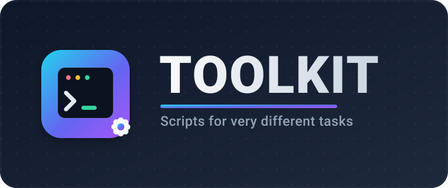

<p align="center">
  
</p>

<p align="center">
  <b>Растущая коллекция скриптов для совершенно разных задач.</b><br>
  <sub>Системное администрирование · автоматизация · разовые помощники — каждый скрипт описан и готов к запуску.</sub>
</p>

<p align="center">
  <a href="README.md">🇬🇧 English</a> &nbsp;•&nbsp; <a href="README.ru.md">🇷🇺 Русский</a>
</p>

<p align="center">
  
  
  
</p>

---

## 📖 О проекте

`toolkit` — это единый дом для самостоятельных скриптов, каждый из которых решает свою,
не связанную с другими задачу: от обслуживания серверов до быстрых помощников для автоматизации.
Общего фреймворка нет — каждый скрипт самодостаточен, описан ниже и может быть скопирован
и запущен отдельно.

Этот README — главная страница проекта, и он растёт вместе с репозиторием: **у каждого нового
скрипта появляется свой блок** с кратким описанием и командами для запуска.

## 🎛 Одна точка входа — `./toolkit.sh`

> Всё, что описано ниже, можно просмотреть, проверить и запустить из одного TUI. Он находит все
> скрипты в репозитории, разбирается, что каждому нужно, показывает, подходит ли **эта** машина, и
> запускает выбранный после одного подтверждения.

```bash
chmod +x toolkit.sh
./toolkit.sh
```

<p align="center">
  <sub>↑↓ выбрать скрипт · ⏎ сводка и проверка системы · ⏎ ещё раз — запуск · <code>p</code> сухой прогон · <code>o</code> параметры · <code>d</code> документация · <code>/</code> фильтр · <code>q</code> выход</sub>
</p>

Каждый пункт помечен тем, что лаунчер выяснил про вашу машину:

| | Значение |
|---|---|
| ✔ | готов — все требования выполнены |
| ▲ | запустится, но прочитайте примечания (не задан аргумент, порт занят) |
| ✖ | заблокирован — не тот дистрибутив, нет root, нет нужной команды |
| ● | уже установлено / уже присутствует здесь |

При выборе скрипта показывается полная сводка до того, как что-либо произойдёт: **что он делает**,
**точная команда**, которая будет выполнена, что именно он **изменит** (файлы, порты, пакеты, нужен
ли root), и **проверка системы** построчно. Ещё одно `⏎` — и он стартует; дальше терминал принадлежит
скрипту, поэтому его собственные вопросы и TUI работают как обычно, а по завершении вы возвращаетесь
в лаунчер.

Скрипты, которые ничего не устанавливают, а просто *запускаются*, стартуют так же — `netwatch`,
`loadtest` и `harden` открывают отсюда свои собственные интерфейсы.

Неинтерактивные режимы:

```bash
./toolkit.sh --list           # что найдено и в каком оно статусе на этой машине
./toolkit.sh --check          # все проверки системы целиком
./toolkit.sh --run harden     # запустить один скрипт напрямую
./toolkit.sh --run netwatch --duration 30m --yes
```

### Как добавить свой скрипт

Положите файл `.sh` или `.py` куда угодно в репозиторий — **он появится в лаунчере при следующем
запуске**, описанный по своему же заголовочному комментарию. Чтобы управлять тем, как он выглядит,
добавьте строки `# toolkit-*:`:

```bash
# toolkit-name: Читаемое имя
# toolkit-kind: installer | tool | destructive
# toolkit-category: Containers
# toolkit-summary: Одна строка о том, что он делает.
# toolkit-os: debian, fedora          # какие системы поддерживает (по умолчанию: любые)
# toolkit-root: yes | no | optional
# toolkit-needs: curl, systemctl      # команды, без которых он ЗАБЛОКИРОВАН
# toolkit-optional: gpg               # желательные; о них просто сообщат
# toolkit-detect: command -v docker   # «оно уже установлено здесь?»
# toolkit-preview: --dry-run          # аргументы для безопасного предпросмотра
# toolkit-run: --yes                  # аргументы по умолчанию
# toolkit-arg: --domain | Домен для публикации | required
# toolkit-ports: 80,443               # порты, которые он откроет (проверяются на занятость)
# toolkit-writes: /opt/thing          # пути, которые он создаёт
# toolkit-danger: что именно разрушает # показывается красным для destructive
# toolkit-confirm: ERASE-ALL-DATA     # слово, которое нужно ввести перед запуском
# toolkit-docs: linux/thing/README.md
```

Самому лаунчеру не нужно ничего, кроме Python 3 (есть в каждом массовом дистрибутиве), а любой скрипт
по-прежнему запускается сам по себе — это слой удобства, а не зависимость.

---

## 🧰 Скрипты

| Скрипт | Категория | Что делает |
|---|---|---|
| [`proxmox-wipe.sh`](#proxmox-wipesh) | Proxmox | Уничтожает всех гостей и обнуляет все несистемные диски, с живым прогресс-баром и ETA. |
| [`install-docker.sh`](#install-dockersh) | Linux | Автоопределяет дистрибутив и ставит Docker Engine + Compose v2 из официальных репозиториев Docker. |
| [`install-pingvin-share.sh`](#install-pingvin-sharesh) | Linux | Разворачивает Pingvin Share через Docker за обратным прокси Caddy с автоматическим HTTPS и открывает фаервол. |
| [`harden.sh`](#hardensh) | Linux | Проверяет защищённость сервера, выставляет оценку и применяет безопасные исправления — с защитой от потери доступа и откатом. |
| [`loadtest`](#loadtest) | Linux | Инструмент нагрузки / теста WAF и rate-limit — измеряет, насколько хорошо **ваш собственный** сайт блокирует трафик, при желании через пул прокси. |
| [`netwatch`](#netwatch) | Linux | Непрерывно измеряет соединение — ICMP, DNS, HTTP, скорость, переключения между провайдерами — пишет всё в SQLite и строит Markdown-отчёт с графиками и вердиктом: на каком именно участке проблема. |

> 📌 Эта таблица пополняется по мере добавления новых скриптов.

---

### `proxmox-wipe.sh`

> 🧨 Уничтожает все ВМ/контейнеры и **обнуляет все несистемные диски** на хосте Proxmox — безопасно, с живым прогресс-баром и ETA.

**Расположение:** [`proxmox/proxmox-wipe.sh`](proxmox/proxmox-wipe.sh)

Системные диски под `/`, `/boot` и `/boot/efi` определяются автоматически двумя независимыми
методами и защищаются; если ничего корректного не найдено — скрипт прерывается, а не действует
наугад. Диски с данными очищаются через `dd` (живой прогресс-бар + ETA) или, с флагом `--discard`,
быстрым аппаратным обнулением.

#### ▶️ Запуск

```bash
chmod +x proxmox/proxmox-wipe.sh
sudo ./proxmox/proxmox-wipe.sh --dry-run
```

#### Команды

| Команда | Назначение |
|---|---|
| `./proxmox-wipe.sh --dry-run` | **Только предпросмотр.** Печатает списки дисков `[KEEP]` / `[WIPE]` и гостей, которые будут удалены — ничего не меняется. Всегда запускайте это первым. |
| `./proxmox-wipe.sh --only sdb,sdc,sdd,sde --dry-run` | Предпросмотр очистки, ограниченной указанными дисками (рекомендуется, самый безопасный вариант). |
| `./proxmox-wipe.sh --only sdb,sdc,sdd,sde` | Очистить **только** явно указанные диски. |
| `./proxmox-wipe.sh` | Очистить **все** несистемные диски на хосте. |

#### Опции

| Флаг | Описание |
|---|---|
| `-n`, `--dry-run` | Предпросмотр всех действий без каких-либо изменений. |
| `--only sdX,sdY` | Ограничить очистку явным списком дисков через запятую; системный диск в списке будет отклонён. |
| `-y`, `--yes` | Пропустить интерактивный запрос подтверждения. |
| `--discard` | Использовать `blkdiscard -z` для быстрого аппаратного обнуления (без прогресс-бара); при отсутствии поддержки откатывается на `dd`. |
| `-h`, `--help` | Показать встроенную справку скрипта. |

> ⚠️ **Разрушительно и необратимо.** Требуются права `root`. Скрипт безвозвратно уничтожает все
> ВМ/контейнеры и обнуляет указанные диски — **отмены нет**. Без `--yes` для продолжения нужно
> ввести `ERASE-ALL-DATA`. Полный лог пишется в `/var/log/proxmox-wipe-*.log`.

---

### `install-docker.sh`

> 🐳 Единый установщик **Docker Engine + Docker Compose v2**, который определяет дистрибутив и запускает нужный официальный путь — apt на Ubuntu/Debian, dnf на Fedora/RHEL/CentOS.

**Расположение:** [`linux/install-docker.sh`](linux/install-docker.sh)

Читает `/etc/os-release`, выбирает нужный пакетный менеджер и репозиторий Docker, затем ставит один
и тот же официальный набор пакетов везде — `docker-ce`, `docker-ce-cli`, `containerd.io`,
`docker-buildx-plugin` и `docker-compose-plugin` (Compose v2, вызывается как `docker compose`). Также
включает службу и добавляет вашего пользователя в группу `docker`. Следует официальным шагам
[docs.docker.com](https://docs.docker.com/engine/install/).

#### ▶️ Запуск

```bash
chmod +x linux/install-docker.sh
sudo ./linux/install-docker.sh --dry-run
```

#### Команды

| Команда | Назначение |
|---|---|
| `./install-docker.sh --dry-run` | **Только предпросмотр.** Печатает определённый дистрибутив и все команды, которые будут выполнены — ничего не меняется. Запускайте это первым. |
| `./install-docker.sh` | Установить Docker после интерактивного подтверждения. |
| `./install-docker.sh --yes` | Установить без вопросов (считать ответ «да») — удобно для автоматизации. |

#### Опции

| Флаг | Описание |
|---|---|
| `-n`, `--dry-run` | Предпросмотр всех шагов без каких-либо изменений. |
| `-y`, `--yes` | Пропустить запрос подтверждения (неинтерактивно). |
| `--no-start` | Не включать/не запускать службу `docker` (systemd). |
| `--no-group` | Не добавлять текущего пользователя в группу `docker`. |
| `-h`, `--help` | Показать встроенную справку скрипта. |

> 💡 Поддерживаются: **Ubuntu / Debian** (apt) и **Fedora / RHEL / CentOS** (dnf). Запускайте от `root`
> или через `sudo`. После установки перелогиньтесь (или выполните `newgrp docker`), чтобы
> использовать Docker без `sudo`, и проверьте командой `docker run hello-world`.

---

### `install-pingvin-share.sh`

> 🐧 Единый установщик, который разворачивает **Pingvin Share** (self-hosted обмен файлами) через Docker Compose и публикует его **на вашем домене с автоматическим HTTPS**, вместе с фаерволом.

**Расположение:** [`linux/install-pingvin-share.sh`](linux/install-pingvin-share.sh)

Определяет семейство дистрибутива, проверяет наличие Docker + Compose v2 — и если их нет, запускает
[`install-docker.sh`](#install-dockersh) из этого же репозитория (локальный файл рядом или скачивает
с GitHub). По умолчанию разворачивает стек **Pingvin Share + обратный прокси Caddy**, который сам
получает бесплатный сертификат Let's Encrypt для вашего `--domain` (без certbot и ручного продления),
выставляет `TRUST_PROXY=true`, открывает **80/443** в фаерволе (`ufw` на apt-дистрибутивах,
`firewalld` на dnf), помечает тома для SELinux и поднимает всё. Флаг `--no-proxy` публикует Pingvin
Share напрямую на порту (без TLS — для использования за уже существующим прокси).

#### ▶️ Запуск

```bash
chmod +x linux/install-pingvin-share.sh
# С доступом из интернета, HTTPS на вашем домене (сначала предпросмотр):
sudo ./linux/install-pingvin-share.sh --domain share.example.com --email you@example.com --dry-run
sudo ./linux/install-pingvin-share.sh --domain share.example.com --email you@example.com
```

> Направьте **A/AAAA-запись домена на сервер** и убедитесь, что порты **80 + 443** доступны из
> интернета *до* запуска — они нужны Caddy для выпуска сертификата.

#### Команды

| Команда | Назначение |
|---|---|
| `./install-pingvin-share.sh --domain d.tld --dry-run` | **Только предпросмотр.** Печатает определённый дистрибутив и все файлы/команды — ничего не меняется. Запускайте это первым. |
| `./install-pingvin-share.sh --domain d.tld --email you@d.tld` | Установка за Caddy с автоматическим HTTPS для `d.tld`. |
| `./install-pingvin-share.sh --reinstall --domain d.tld --email you@d.tld` | Снести стек и установить заново с нуля (данные `./data` сохраняются). |
| `./install-pingvin-share.sh --status --domain d.tld` | Показать статус контейнеров, сертификата и DNS/доступности. |
| `./install-pingvin-share.sh --uninstall` | Остановить и удалить стек (загрузки и БД сохраняются). |
| `./install-pingvin-share.sh --no-proxy --port 3000` | Установить только Pingvin Share, опубликовав напрямую на порту (без TLS). |

#### Опции

| Флаг | Описание |
|---|---|
| `--reinstall` | Действие: снести и установить заново с нуля. |
| `--uninstall` | Действие: остановить и удалить стек (данные `./data` сохраняются, если нет `--purge-data`). |
| `--status` | Действие: показать статус контейнеров, сертификата и DNS/доступности. |
| `-d`, `--domain <fqdn>` | Домен для публикации (обязателен, если не указан `--no-proxy`). |
| `-e`, `--email <addr>` | Email для Let's Encrypt / ACME (рекомендуется в режиме прокси). |
| `-p`, `--port <port>` | Порт хоста для прямого режима (по умолчанию `3000`, только с `--no-proxy`). |
| `--dir <path>` | Каталог установки (по умолчанию `/opt/pingvin-share`). |
| `--image <ref>` | Образ контейнера (по умолчанию `stonith404/pingvin-share`). |
| `--no-proxy` | Не использовать Caddy/HTTPS, опубликовать Pingvin Share напрямую на `--port`. |
| `--no-firewall` | Не трогать фаервол. |
| `--staging` | Использовать **staging**-CA Let's Encrypt (без лимитов, для тестов). |
| `--self-signed` | Использовать внутренний CA Caddy — мгновенный HTTPS с предупреждением в браузере. |
| `--purge-data` | Вместе с `--uninstall`/`--reinstall` также удалить загрузки и БД. |
| `--reset-tls` | Вместе с `--uninstall`/`--reinstall` также стереть сохранённый сертификат/аккаунт Caddy (форсирует новый выпуск). |
| `-n`, `--dry-run` | Предпросмотр всех шагов без каких-либо изменений. |
| `-y`, `--yes` | Пропустить запрос подтверждения (неинтерактивно). |
| `-h`, `--help` | Показать встроенную справку скрипта. |

#### 🔐 Если HTTPS не поднимается

Caddy получает бесплатный сертификат Let's Encrypt **только если Let's Encrypt может достучаться до
вашего сервера из интернета по портам 80 и 443**. Если `--status` показывает отсутствие сертификата,
проверьте по порядку:

1. **Облачный фаервол / security group.** Скрипт открывает фаервол *ОС*, но у большинства провайдеров
   (AWS, GCP, **Oracle Cloud**, Hetzner, Azure…) есть **отдельный** фаервол, который нужно открыть в их
   веб-консоли — разрешите там входящие **TCP 80 и 443**.
2. **DNS.** **A/AAAA-запись домена должна указывать именно на этот сервер** — `--status` печатает
   определённый IP рядом с публичным IP хоста, чтобы их можно было сравнить.
3. **Лимиты.** На время отладки используйте `--staging`, чтобы не упереться в лимиты Let's Encrypt;
   когда заработает — перезапустите без `--staging` для доверенного сертификата.

Чтобы сразу получить рабочий адрес (например, за CDN или просто чтобы проверить само приложение),
используйте `--self-signed` — Caddy отдаёт HTTPS со своим CA (браузер покажет однократное предупреждение).

> ⚠️ Сертификат **«Caddy Local Authority»** (срок ≈12 ч, предупреждение в браузере) означает, что
> включён `--self-signed`. Чтобы вернуть настоящий сертификат Let's Encrypt, переустановите **без**
> `--self-signed`; добавьте `--reset-tls`, чтобы отбросить закешированный самоподписанный сертификат и
> форсировать новый запрос:
> `sudo ./linux/install-pingvin-share.sh --reinstall --reset-tls --domain d.tld --email you@d.tld`.
> `--reinstall` по умолчанию сохраняет загрузки и действующий сертификат, поэтому его безопасно
> запускать повторно.

> 💡 Поддерживаются: **Ubuntu / Debian** и **Fedora / RHEL / CentOS**. Запускайте от `root` или через
> `sudo`. Первый зарегистрированный аккаунт становится администратором; затем откройте **Configuration**
> и задайте *App URL* (`https://<домен>`) и максимальный размер передачи. Compose-файл лежит в каталоге
> установки — управляйте им через `sudo docker compose -f /opt/pingvin-share/docker-compose.yml logs -f`
> (и `… pull && … up -d` для обновления).

---

---

### `harden.sh`

> 🛡 **Аудит и харденинг Linux-сервера — так, чтобы не потерять доступ.** По умолчанию — аудит только на чтение с оценкой; `--apply` чинит то, что можно починить безопасно, `--rollback` откатывает.

**Расположение:** [`linux/harden.sh`](linux/harden.sh)

Проверяет то, из-за чего серверы реально взламывают: SSH (вход root, парольная аутентификация,
пустые пароли, число попыток, grace time, X11 forwarding), **файрвол** (установлен, активен, политика
deny, SSH разрешён), **автоматические обновления безопасности**, **fail2ban**, набор **kernel sysctl**
(редиректы, source routing, SYN cookies, ASLR, `dmesg_restrict`), **учётные записи** (пустые пароли,
дубликаты uid 0) и то, что **слушает на публичных интерфейсах**. Всё это сводится в оценку 0–100 с
буквенным грейдом, и для каждой находки указан флаг, который её исправляет.

`--apply` затем пишет drop-in для sshd, включает и настраивает файрвол, включает автообновления
безопасности, ставит fail2ban с jail для sshd и применяет sysctl.

#### 🔒 Защита от потери доступа

Скрипт рассчитан на машину, к которой вы подключены по SSH, поэтому:

- парольный вход отключается **только** если у root или у запустившего пользователя уже есть рабочий
  SSH-ключ — иначе именно этот пункт пропускается с громким предупреждением;
- файрвол открывается для **настоящего** порта SSH (взятого из работающего конфига) **до** того, как
  он будет включён;
- новый конфиг проверяется через `sshd -t` и откатывается, если отклонён; а если sshd не мог проверить
  свой конфиг и **до** изменений, секция SSH пропускается целиком, а не правится вслепую;
- sshd **перечитывает конфиг, а не перезапускается**, поэтому текущая сессия сохраняется;
- каждый изменённый файл копируется в `/var/backups/toolkit-harden/<timestamp>/`, а `--rollback`
  возвращает всё назад.

#### ▶️ Запуск

```bash
chmod +x linux/harden.sh
./linux/harden.sh                          # только аудит — ничего не меняет
sudo ./linux/harden.sh --apply --dry-run   # показать все изменения, не делая их
sudo ./linux/harden.sh --apply             # применить, после ввода YES
sudo ./linux/harden.sh --rollback          # откатить последнее применение
```

| Флаг | Описание |
|---|---|
| `--audit` | Аудит только на чтение (по умолчанию). |
| `--apply` | Применить безопасные исправления. |
| `-n`, `--dry-run` | С `--apply`: напечатать все изменения, ничего не делая. |
| `-y`, `--yes` | Пропустить подтверждение `YES`. |
| `--rollback` | Восстановить последнюю резервную копию и перезагрузить службы. |
| `--report <файл>` | Дополнительно записать аудит в Markdown. |
| `--ssh-port <n>` | Порт SSH, который держать открытым (по умолчанию — из `sshd_config`). |
| `--allow-user <u>` | Ограничить вход по SSH этим пользователем (`AllowUsers`). |
| `--strict` | Ненулевой код возврата, если аудит нашёл провалы (для CI). |
| `--no-ssh` · `--no-firewall` · `--no-updates` · `--no-fail2ban` · `--no-sysctl` | Пропустить отдельные секции. |
| `-h`, `--help` | Полная справка. |

> 💡 После `--apply` **откройте вторую SSH-сессию, прежде чем закрывать текущую** — скрипт напоминает
> об этом сам. Поддержка применения: Debian/Ubuntu и Fedora/RHEL; аудит работает где угодно.

### `loadtest`

> 🐧 **Авторизованный** инструмент нагрузки / теста WAF и rate-limit (Python 3, только стандартная библиотека, запуск через `.sh`). Создаёт настраиваемую HTTP-нагрузку на **ваш собственный** сайт — при желании через пул прокси со случайной ротацией — и показывает, сколько трафика отфильтровала защита.

**Расположение:** [`linux/loadtest/`](linux/loadtest/) &nbsp;·&nbsp; полная документация: [`linux/loadtest/README.md`](linux/loadtest/README.md)

> ⚠️ **Запускайте только против систем, которыми вы владеете или на тест которых есть письменное
> разрешение.** Несанкционированное нагрузочное тестирование — это злоупотребление и, скорее всего,
> незаконно. Инструмент использует опознаваемый `User-Agent`, маскирует учётные данные прокси в отчёте
> и требует однократного подтверждения авторизации.

Сделан для проверки того, что rate limiting и правила WAF на **nginx / Apache** действительно блокируют
распределённый трафик с ротацией IP — результаты удобно сопоставлять со своими дашбордами в Grafana.
Принимает прокси в формате `login:passwd@ip:port` (по одному на строку, берутся в случайном порядке),
а также время работы, задержку между запросами (на воркера) и параллельность. Запуск без аргументов —
интерактивное **TUI-меню + живой дашборд**; либо флаги (`--k v`, `--k=v` или `--k:v`). Лаунчер сам
доустановит Python 3. Отчёт пишется в `.txt`: доля прошедших vs заблокированных
(`401/403/405/406/409/415/429/451`) vs `5xx` vs ошибки, block rate, перцентили задержек и таблица по
каждому прокси.

#### ▶️ Запуск

```bash
chmod +x linux/loadtest/loadtest.sh
# интерактивное TUI-меню:
./linux/loadtest/loadtest.sh
# либо неинтерактивно (как в форме --k:v):
./linux/loadtest/loadtest.sh --url https://my.site --proxy:/path/proxies.txt --duration 60s --delay 0.1 --concurrency 50 --yes
```

| Флаг | Описание |
|---|---|
| `--url`, `--target` | Целевой URL (обязателен). |
| `--proxy`, `--proxies` | Файл `.txt` с прокси (`login:passwd@ip:port` построчно, случайный порядок). |
| `--no-proxy`, `--direct` | Слать напрямую с этого хоста (базовый прогон, без прокси). |
| `--duration`, `--time` | Длительность: `90s`, `5m`, `1h` (по умолчанию `30s`). |
| `--delay`, `--sleep` | Пауза между запросами на воркера (по умолчанию `0`). |
| `--concurrency`, `-c` | Параллельные воркеры (по умолчанию `20`). |
| `--timeout` · `--method` · `--insecure` | Таймаут запроса · HTTP-метод · не проверять TLS. |
| `--output`, `--result` | Файл отчёта (по умолчанию `loadtest-<timestamp>.txt`). |
| `--no-tui` · `--yes` · `--help` | Простой вывод · подтвердить авторизацию · справка. |

---

---

### `netwatch`

> 📡 Непрерывный монитор качества интернета (Python 3, только стандартная библиотека, запуск через `.sh`). Опрашивает соединение раз в секунду сколько нужно, складывает **все** замеры в **SQLite**, затем строит **Markdown-отчёт с SVG-графиками** и вердиктом: *на каком участке* проблема.

**Расположение:** [`linux/netwatch/`](linux/netwatch/) &nbsp;·&nbsp; полная документация: [`linux/netwatch/README.md`](linux/netwatch/README.md)

Сделан ровно под ту неисправность, которую руками не поймать — *«интернет отваливается на пару
секунд, и непонятно почему»*. Пингует **шлюз → второй роутер → первый хоп провайдера → три публичных
якоря** раз в секунду (записывая **TTL** каждого ответа), проверяет **DNS** на нескольких резолверах
по UDP/TCP/DoH, шлёт **HTTPS-запросы с разбивкой по фазам** (DNS/TCP/TLS/TTFB), меряет **скорость и
задержку под нагрузкой** (настоящая оценка bufferbloat), снимает **traceroute, path MTU, доступность
TCP-портов, NTP** и **локальный интерфейс** (ошибки, drop'ы, потеря линка, уровень Wi-Fi). В
оперативной памяти ничего не копится — отдельный поток-писатель стримит всё в базу.

Для схемы с **балансировщиком на двух провайдерах** публичный IP перепроверяется каждые пару секунд
одним UDP-пакетом DNS, каждое изменение подтверждается вторым независимым источником, каждому адресу
подставляется **ASN/оператор**, а в отчёте — **потери, задержки, джиттер и MOS отдельно по каждому
аплинку**, список всех переключений и во что каждое обошлось. TTL ответов служит вторым, более
частым свидетелем и ловит переключения короче интервала опроса.

Внешние бинарники не нужны: если `ping` и `traceroute` отсутствуют (минимальные контейнеры),
netwatch сам делает ICMP-echo, traceroute и определение path MTU через сокет.

#### ▶️ Запуск

```bash
chmod +x linux/netwatch/netwatch.sh
# интерактивное TUI-меню + живой дашборд:
./linux/netwatch/netwatch.sh
# 90-секундная диагностика или длительный прогон в фоне:
./linux/netwatch/netwatch.sh --quick
./linux/netwatch/netwatch.sh --duration 8h --plan 100 --yes --no-tui
# пересобрать отчёт из уже снятого дампа:
./linux/netwatch/netwatch.sh --analyze ./netwatch-20260821-120000
```

| Флаг | Описание |
|---|---|
| `--duration`, `--time` | Сколько наблюдать: `90s`, `30m`, `2h`, `1d` (`0` — пока не нажмёте `q`). |
| `--interval` · `--wan-interval` | Интервал ICMP-проб (по умолчанию `1.0` с) · интервал проверки публичного IP / переключений (`2.0` с). |
| `--dns-interval` · `--http-interval` · `--link-interval` | Интервалы проб DNS, HTTP и локального интерфейса. |
| `--speed-interval` · `--speed-max-mb` | Пауза между тестами скорости (`0` — выключить) · лимит трафика на тест. |
| `--trace-interval` · `--plan` | Пауза между traceroute (`0` — выключить) · ваш тариф в Мбит/с. |
| `--targets` · `--urls` · `--resolvers` | Дополнительные цели пинга (`name=host`), HTTP-эндпоинты и DNS-серверы. |
| `--no-speed` · `--no-trace` · `--no-ipv6` · `--no-mtu` | Отключить отдельные пробы (лимитный трафик, закрытые сети). |
| `--out` · `--db` · `--label` | Каталог результата · явный файл SQLite · подпись в заголовке отчёта. |
| `--analyze <путь>` · `--runs <путь>` | Пересобрать отчёт из дампа · показать прогоны в базе. |
| `--quick` · `--no-tui` · `--yes` · `--help` | Быстрая диагностика · простой вывод · без подтверждения · справка. |

> 💡 Результат — каталог на каждый прогон: `report.md`, `summary.json`, `netwatch.db` и `charts/`.
> ICMP на большинстве дистрибутивов работает без root; иначе netwatch откатывается на `ping`, затем
> на TCP-пробы и пишет об этом в отчёте.

---

## 🗂 Структура репозитория

```text
toolkit/
├── toolkit.sh       # ← лаунчер: просмотр, проверка и запуск всего
├── toolkit.py       # его TUI + обнаружение скриптов + проверки системы
├── assets/
│   └── logo.svg
├── linux/
│   ├── harden.sh
│   ├── install-docker.sh
│   ├── install-pingvin-share.sh
│   ├── loadtest/
│   │   ├── loadtest.sh       # лаунчер (ставит Python 3, пробрасывает аргументы)
│   │   ├── loadtest.py       # тестер (TUI + движок)
│   │   └── README.md
│   └── netwatch/
│       ├── netwatch.sh       # лаунчер (ставит Python 3, пробрасывает аргументы)
│       ├── netwatch.py       # монитор + анализ + генератор отчёта
│       └── README.md
├── proxmox/
│   └── proxmox-wipe.sh
├── README.md        # English
└── README.ru.md     # Русский (этот файл)
```


---

<p align="center"><sub>⚠️ Используйте эти скрипты на свой страх и риск. Проверяйте исходный код перед запуском всего, что затрагивает диски или данные.</sub></p>
